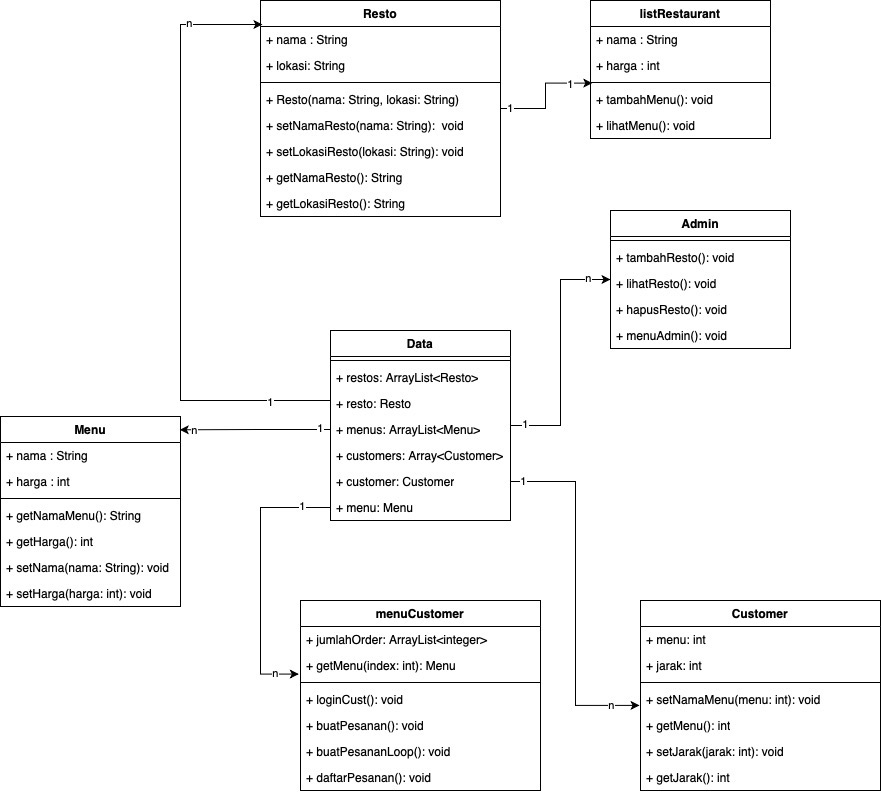

## Pengenalan

Program onlineFood ini merupakan sebuah project yang menggunakan 
bahasa pemrograman Java dengan konsep Object Oriented Programming (OOP). 
Project onlineFood ini sendiri merupakan suatu program restoran yang berbasis online,
dimana semua sistem beli membeli dilakukan secara online.
Pada program ini, user dapat masuk sebagai **admin** maupun **customer** pada 
program onineFoog yang telah dibuat. Adapun beberapa fitur 
yang dapat diakses ketika melakukan run pada program ini.
 

##### Fitur Admin
- Menambahkan restaurant 
- Melihat restaurant
- Membuat menu di masing-masing restaurant 
- Menghapus restaurant
 
##### Fitur Customer
- Membuat pesanan pada setiap restaurant
- Melihat pesanan / History pesanan yang  dibuat
 
 
## Alur Program
Berikut merupakan alur atau flow jalannya program onlineFood ini. 
 
### Login
Hal pertama yang user perlu lakukan ketika menjalankan program ini adalah meng-input
data diri atau kredensial agar dapat melanjutkan program. Terdapat dua opsi 
input yang dapat digunakan untuk melanjutkan program, yaitu ***admin*** (administrator) dan ***customer*** (pelanggan).
Berikut merupakan syntax untuk melanjutkan program sebagai admin maupun customer

### Menu Admin

1. ***Tampilan Awal***
 
Berikut merupakan tampilan awal ketika user masuk sebagai admin pada program,
dimana admin dapat melihat restaurant, menambah restaurant, menghapus resturant. Selain itu,
admin juga dapat menambahkan menu setelah menambahkan restaurant.
 

 

2. ***Menu Melihat Restaurant***
 
Admin dapat melihat restaurant yang tersedia atau yang telah dibuat pada menu 'Lihat Restaurant'. Berikut merupakan
tampilan ketika memilih menu 'Lihat Restaurant' ketika admin belum memasukan.
restaurant.
 

 
Berikut merupakan tampilan menu 'Lihat Restaurant' jika sudah ada data restaurant.
 

 
Admin dapat menambahkan menu setelah berhasil membuat restaurant. Berikut merupakan tampilan tambah menu, 
dimana user memilih untuk menambah menu pada restaurant Mcdonald.
 

 

 
3. ***Menu Menambah Restaurant***
    
   Admin dapat membuat restaurant pada menu 'Tambah Restaurant'. Berikut merupakan
   tampilan ketika admin sudah masuk ke menu 'Tambah Restaurant'.
    
   
    
4. ***Menu Menghapus Restaurant***
    
   Admin dapat melakukan penghapusan data restaurant yang tersedia pada menu 'Hapus Restaurant'.
   Berikut merupakan tampilan ketika admin masuk ke menu 'Hapus Restaurant', dimana pada gambar dibawah admin melakukan
   penghapusan data restaurant Burger King.
    
   
    
   
 
5. ***Menu Kembali ke Menu Login***
Admin juga dapat kembali lagi ke menu login atau tampilan awal ketika admin memilih
menu 'Kembali ke Login'.

### Menu Customer

1. ***Tampilan Awal***
 
Berikut merupakan tampilan awal ketika user masuk sebagai customer pada program,
dimana customer dapat membuat pesanan, melihat pesanan, dan kembali ke tampilan awal.
 

 

2. ***Membuat Pesanan***
 
Customer dapat melakukan pembuatan pesanan pada menu 'Buat Pesanan'. Namun, sebelum 
membuat pesanan, customer wajib untuk memilih restaurant yang diinginkan agar dapat melihat menu yang 
tersedia pada restaurant tersebut. Berikut merupakan tampilan dari flow yang terjadi
ketika customer ingin membuat pesanan.
 

 

 

Setelah melakukan pemesanan menu, maka akan muncul tampilan daftar pesanan, dimana 
daftar pesanan menampilkan menu yang dipesan, jumlah menu yang dipesan, jarak restaurant dari lokasi 
yang dituju, dan total harga dari pemesanan.
 
3. ***Melihat Pesanan***
 
Customer dapat melihat pesanan atau history pesanan yang telah dibuat pada menu 'Lihat Pesanan'. Berikut merupakan tampilan
 dari menu 'Lihat Pesanan'.
 

 

4. ***Menu Kembali ke Menu Login***
   Customer juga dapat kembali lagi ke menu login atau tampilan awal ketika customer memilih
   menu 'Menu Login'.

## Unified Modeling Language (UML)

Unified Modeling Language atau UML merupakan jenis diagram yang digunakan pada 
pengambaran program agar dapat lebih jelas menggambarkan struktur OOP. 
Berikut merupakan UML dari program onlineFood.
 
 
